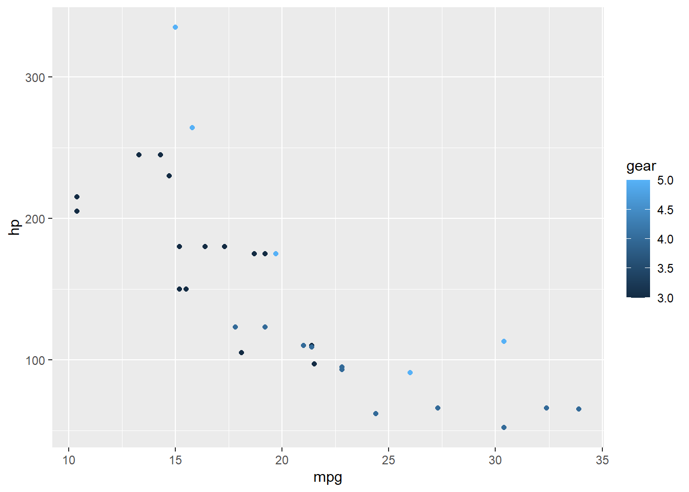

# (PART) Data Visualization {.unnumbered}

# ggplot2 Example 1 {#dv-eg1}

Here is an example of a scatter plot where the color of points are mapped to a variable


```r
library(tidyverse)

# draw a scatter plot of mpg vs hp, colored by gear
mtcars %>%
  ggplot(., aes(x=mpg, y=hp, color=gear)) +
  geom_point()
```


